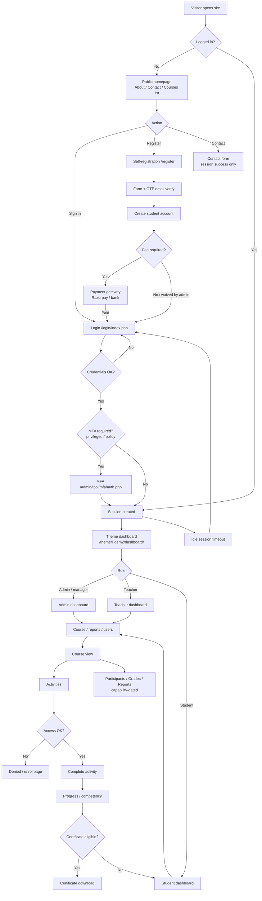
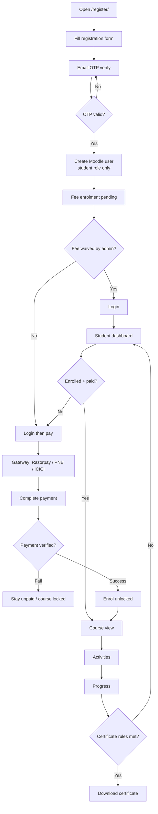
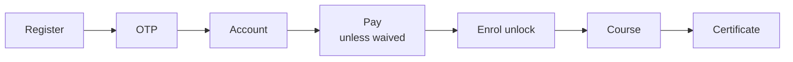
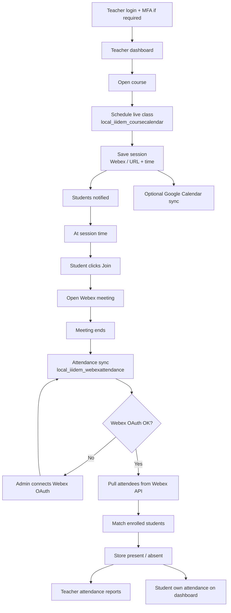
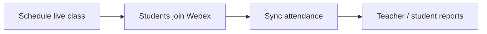
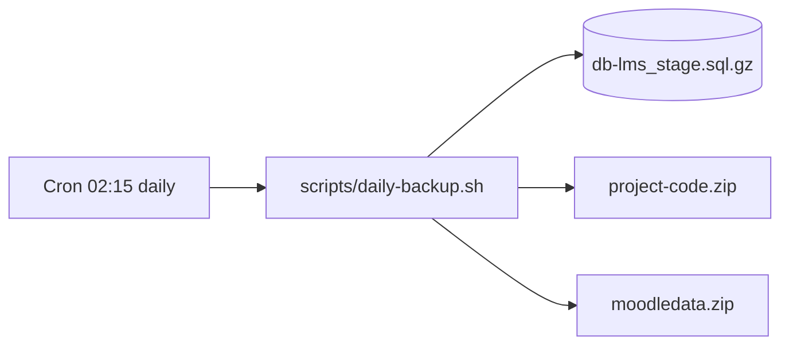

# IIIDEM Moodle — site flow diagrams

High-level flows for the IIIDEM LMS (`theme_iiidem2`). Staging host example: `staginglms.eci.gov.in`.

View these diagrams in any Markdown preview that supports [Mermaid](https://mermaid.js.org/) (GitHub, GitLab, VS Code/Cursor Mermaid extension).

---

## 1. Site overview

---

## 2. Student: registration → payment → course

### Student path (one line)

**Text:** Register → OTP → account → pay (unless waived) → enrol unlock → course → certificate.

---

## 3. Teacher: live class → attendance

### Teacher path (one line)

**Text:** Schedule live class → students join Webex → sync attendance → teacher/student reports.

---

## 4. Ops: daily backup (staging)

Not a user journey — host cron.

Paths (staging example):

| Item | Path |
|------|------|
| Code | `/var/www/html/lms_stage` |
| Dataroot | `/var/www/html/moodledata_stage` |
| Backup output | `/var/backups/iiidem/` |
| Cron env | `/etc/iiidem/backup.env` |

See [daily-backup-cron.md](daily-backup-cron.md).

---

## Related code areas

| Flow | Main areas |
|------|------------|
| Register / OTP | `register/`, `theme/iiidem2` registration helpers |
| Payment | `enrol/fee`, `payment/gateway/razorpay`, `pnb`, `icici` |
| Dashboards | `theme/iiidem2/dashboard/` |
| Live class | `local/iiidem_coursecalendar` |
| Webex attendance | `local/iiidem_webexattendance` |
